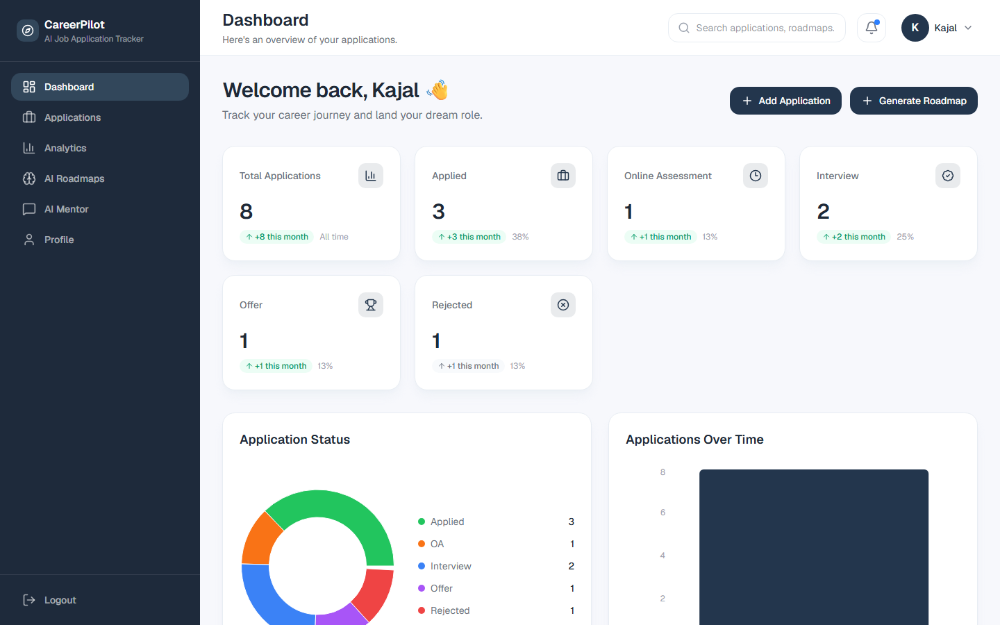
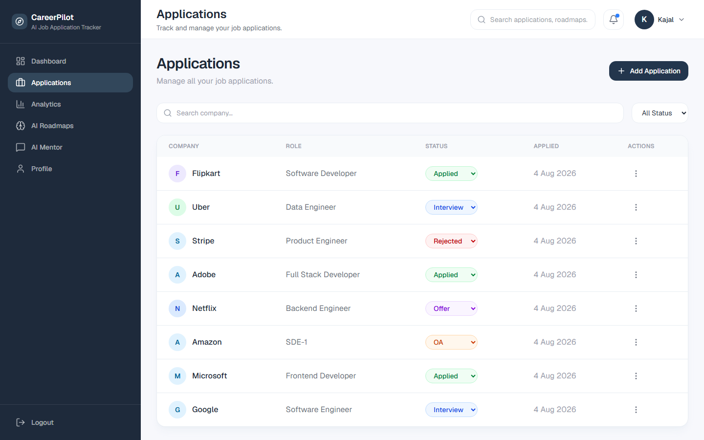
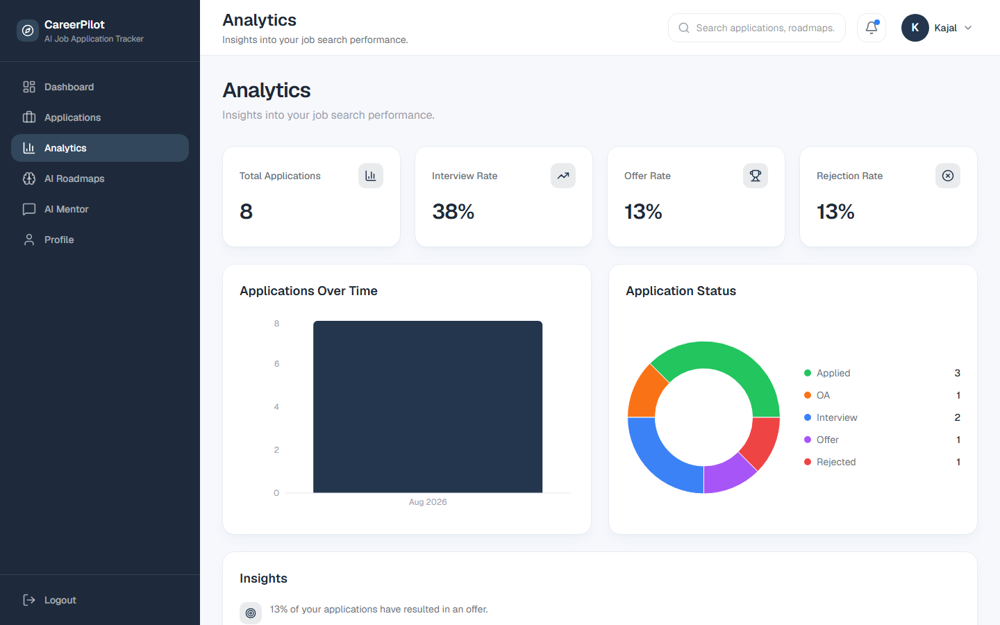
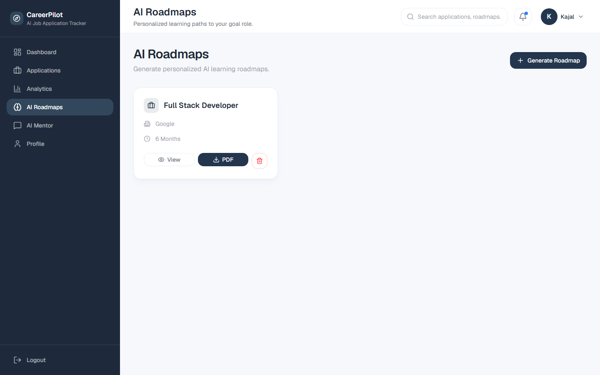
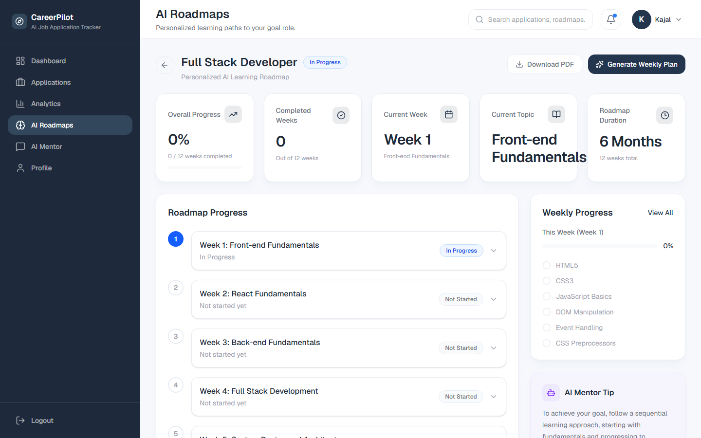
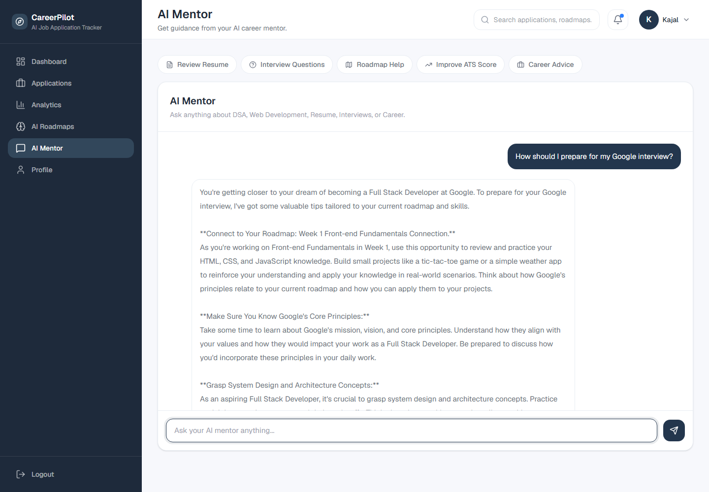

# 🚀 CareerPilot

CareerPilot is a full-stack, AI-powered MERN application that helps job seekers manage their entire job search in one place — tracking applications, generating an AI-personalized learning roadmap, analyzing progress, and getting context-aware career guidance from an AI mentor that actually knows what roadmap week you're on.

Built as a portfolio project to demonstrate practical full-stack + AI-integration skills (React, Node/Express, MongoDB, and the Groq LLM API) rather than as production/enterprise software.

---

## 📸 Screenshots

<table>

<tr>
<td align="center"><b>Dashboard</b><br></td>
<td align="center"><b>Applications</b><br></td>
<td align="center"><b>Analytics</b><br></td>
</tr>
<tr>
<td align="center"><b>AI Roadmaps</b><br></td>
<td align="center"><b>Roadmap Progress</b><br></td>
<td align="center"><b>AI Mentor</b><br></td>
</tr>
<tr>
<td></td>
<td></td>
</tr>
</table>

---

# ✨ Features

## 🔐 Authentication

- User Registration & Login
- JWT-based Authentication
- Protected Routes
- User-specific Data Isolation

## 📋 Job Application Management

- Add / Update / Delete Applications
- Search & Filter Applications
- Update Application Status (Applied, OA, Interview, Offer, Rejected)
- Resume Upload per Application (PDF)
- View Uploaded Resume
- Professional Status Badges

## 📄 Resume Management

- Upload / Replace Resume (PDF)
- Resume Text Extraction via `pdf-parse`

## 🤖 AI Features (Groq LLM)

- **ATS Resume Analysis** — score, feedback, skill-gap detection, improvement suggestions
- **AI Roadmap Generation** — a personalized, week-by-week learning roadmap for a target role, company, and duration
- **AI Weekly Plan Generation** — detailed topics/resources generated per week as you progress
- **Download Roadmap as PDF**
- **AI Mentor Chat** — a context-aware chat assistant that reads your latest roadmap and recent conversation history before answering, so its advice references your actual target role, dream company, and current week instead of generic tips

## 📊 Dashboard & Analytics

- Total Applications, Applied, OA, Interview, Offer, Rejected counts with month-over-month trend chips
- Application Status breakdown (donut chart)
- Applications Over Time (bar chart)
- Interview / Offer / Rejection rate cards
- Recent Applications table

## 🧭 Roadmap Progress

- Overall progress %, completed weeks, current week/topic, and total roadmap duration
- Week-by-week timeline with per-week status
- Weekly checklist of topics with progress tracking
- AI Mentor tip card tailored to the roadmap
- Generate the next week's plan on demand

## 👤 Profile

- View account details (name, email, member since)
- Logout

---

# 🛠️ Tech Stack

## Frontend

- React 19 + Vite
- React Router DOM v7
- Tailwind CSS v4
- Lucide React (icons)
- React Hook Form + Zod (form validation)
- Axios
- Recharts (charts)
- React Hot Toast
- date-fns

## Backend

- Node.js + Express 5
- MongoDB + Mongoose
- JWT Authentication (`jsonwebtoken`) + `bcryptjs`
- Multer (file uploads)
- `pdf-parse` (resume text extraction)
- `pdfkit` (roadmap PDF export)
- Groq SDK (`llama-3.1-8b-instant` for AI Mentor chat, `llama-3.3-70b-versatile` for roadmap/ATS/week-plan generation)

---

# 📂 Project Structure

```text
CareerPilot/
├── backend/
│   ├── config/
│   ├── controllers/       # auth, application, ai, analytics, chat, week
│   ├── middleware/
│   ├── models/            # User, Application, Roadmap, Chat
│   ├── routes/
│   ├── services/          # chatService (AI Mentor prompt building)
│   ├── uploads/
│   ├── utils/
│   └── server.js
│
├── frontend/
│   └── src/
│       ├── components/
│       │   ├── applications/
│       │   ├── analytics/
│       │   ├── auth/
│       │   ├── charts/
│       │   ├── chat/
│       │   ├── common/          # Button, Card, Input, Modal, Badge, Loader, ActionMenu...
│       │   ├── dashboard/
│       │   ├── layout/          # Sidebar, Navbar
│       │   ├── roadmapProgress/
│       │   └── roadmaps/
│       ├── pages/
│       │   ├── Login/
│       │   ├── Register/
│       │   ├── Dashboard/
│       │   ├── Applications/
│       │   ├── Analytics/
│       │   ├── Roadmaps/
│       │   ├── RoadmapProgress/
│       │   ├── Chat/
│       │   └── Profile/
│       ├── services/            # API layer (axios calls per domain)
│       ├── context/              # AuthContext
│       ├── layouts/
│       ├── routes/
│       ├── App.jsx
│       └── main.jsx
│
└── README.md
```

---

# 📸 Current Workflow

```text
Register / Login
      │
      ▼
   Dashboard  ──────────────┐
      │                     │
      ▼                     ▼
Track Applications   Generate AI Roadmap
      │                     │
      ├──────────────┐      ▼
      ▼              ▼   Roadmap Progress
Upload Resume   Update Status   │
      │              │          ▼
      └──────┬───────┘   Generate Weekly Plan
             ▼                  │
       ATS Analysis             ▼
                          Ask AI Mentor
                     (context-aware, knows your
                      roadmap + chat history)
```

---

# 🎯 Project Goals

CareerPilot aims to be a complete AI-powered career assistant that helps users:

- Track job applications end-to-end
- Improve resume ATS compatibility
- Identify missing skills
- Follow a personalized, structured learning roadmap
- Visualize application progress
- Get contextual, ongoing guidance from an AI mentor — not just one-off answers

---

# 🚧 Possible Next Steps

- Deploy to a live environment (Vercel/Render)
- Richer roadmap cards on the AI Roadmaps list (progress bar, created date)
- Email notifications for application follow-ups
- Automated tests

---

# 👨‍💻 Author

**Kajal Sachan**

B.Tech CSE (AI) | MERN Stack Developer

---

# 📌 Project Status

## Backend

✅ Authentication
✅ Applications CRUD
✅ Resume Upload & Replace
✅ Resume Parsing
✅ ATS Analysis
✅ AI Roadmap Generation + Weekly Plans
✅ Roadmap PDF Export
✅ Analytics APIs
✅ AI Mentor Chat (context-aware, backed by roadmap + chat history)

## Frontend

✅ Authentication
✅ Dashboard
✅ Analytics
✅ Applications Module (add, delete, search, filter, status update, resume view)
✅ AI Roadmaps + Roadmap Progress page
✅ AI Mentor Chat UI (with quick-action prompts)
✅ Profile Page
✅ Responsive layout with fixed sidebar / sticky navbar
